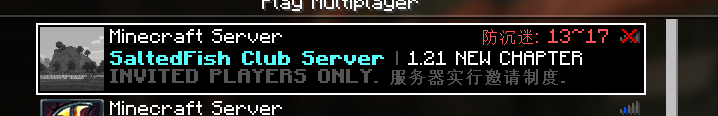

# SFCraft

本仓库为 S.F Craft 服务器的功能 Mod, S.F Craft 是一个邀请制的纯原版生存服务器。  
本插件专门为 SFC 定制，因此您可能需要花费大多功夫来将其用在你的服务器上（比如修改大量的硬编码字符串，强制启用的功能，等等），因此，并不建议这么做。  

本仓库开源供有能力的玩家贡献。

# Features

- 允许指定离线玩家进入正版服务器，与白名单兼容 (`/addwl`)  
  需要注意的是，如果使用此功能添加了正版玩家的名字，那么正版玩家将会以离线用户的 UUID 游玩，这会导致皮肤不显示等问题。
- 限制性的 `/back` 命令  
  切合服务器的需要，本服务器的 `/back` 命令仅在死亡地点半径 100 内有人的情况下才可传送，且传送到附近玩家的位置。
- 更新日志速览  
  新来的玩家将会发放小册子，简要概述服务器特性。  
  该书内容从 `sfcraft/update.log` 生成，每 128 字符一张纸。
- 防沉迷  
  保护每一个玩家的下午，支持自动识别时区，需要下载 GeoIP 数据库 (45MB)。
  
- 人文关怀  
  对于一些年龄比较小的玩家还有一些不太熟悉 MC 的玩家，我们特地设计了一些赦免权，例如无限制的 `/back` 命令。